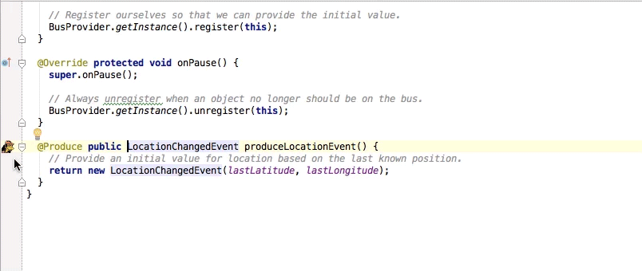
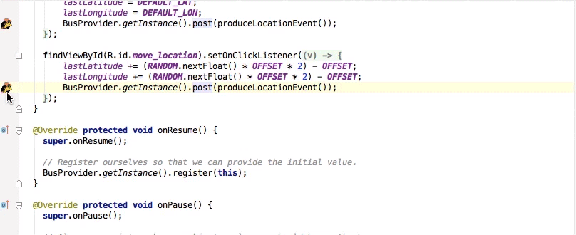

Otto IntelliJ Plugin
====================

Plugin to navigate between events posted by [Otto][1].

Deprecated!
-----------

Otto is deprecated in favor of [RxJava](https://github.com/ReactiveX/RxJava) and
[RxAndroid](https://github.com/ReactiveX/RxAndroid). These projects permit the same event-driven
programming model as Otto, but they’re more capable and offer better control of threading.

If you’re looking for guidance on migrating from Otto to Rx, [this post](http://blog.kaush.co/2014/12/24/implementing-an-event-bus-with-rxjava-rxbus/) is a good start.

### @Produce to @Subscribe

### Event to @Subscribe

Download
--------

[Download][2] the plugin jar and select "Install Plugin From Disk" in IntelliJ's plugin preferences.

License
=======

    Copyright 2013 Square, Inc.

    Licensed under the Apache License, Version 2.0 (the "License");
    you may not use this file except in compliance with the License.
    You may obtain a copy of the License at

       http://www.apache.org/licenses/LICENSE-2.0

    Unless required by applicable law or agreed to in writing, software
    distributed under the License is distributed on an "AS IS" BASIS,
    WITHOUT WARRANTIES OR CONDITIONS OF ANY KIND, either express or implied.
    See the License for the specific language governing permissions and
    limitations under the License.

[1]: http://square.github.io/otto/
[2]: https://github.com/square/otto-intellij-plugin/blob/master/otto-intellij-plugin.jar?raw=true
